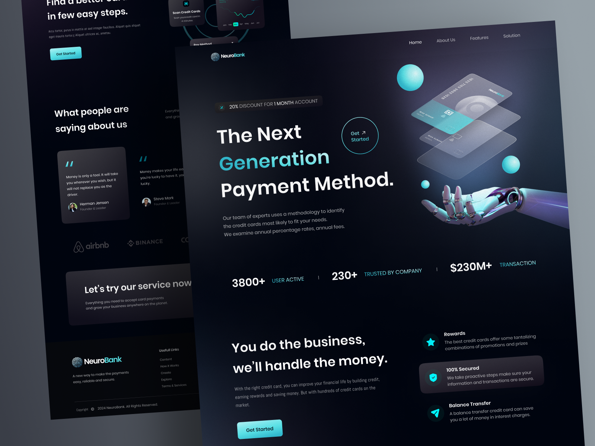

# Neuro Bank

This application was developed using React, ViteJS and TailwindCSS.

## Running

After cloning the repository, access the project folder and execute the commands below:

```sh
npm install
npm run dev
```
## 🔗 Layout
You can view the project layout through 
[from this link](https://www.figma.com/file/EvTvPFb6UBdEU8Wh0IWeQS/NeuroBank?type=design&node-id=0-1&mode=design&t=seHTPd1FgYQTEC0b-0). 
You must have an account on
[Figma](https://www.figma.com)

Visit http://localhost:5173 to view the application.